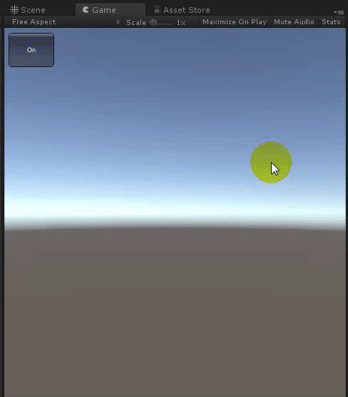
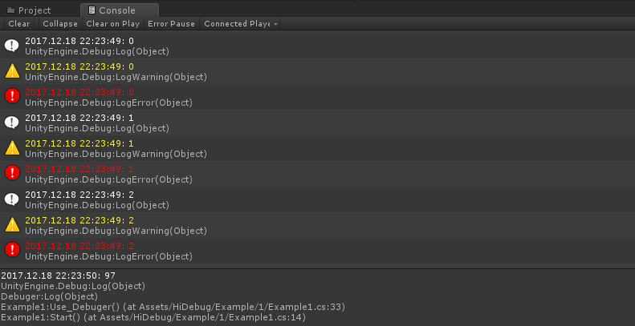
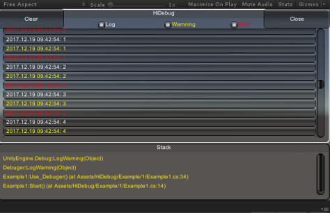
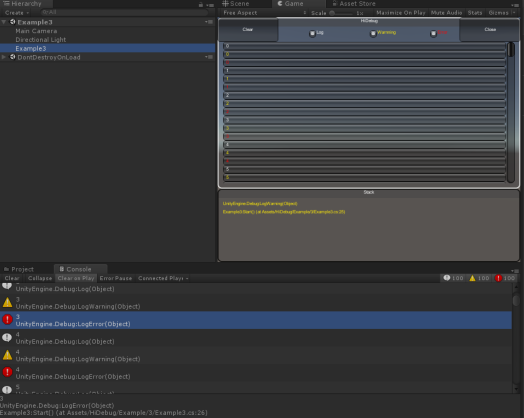
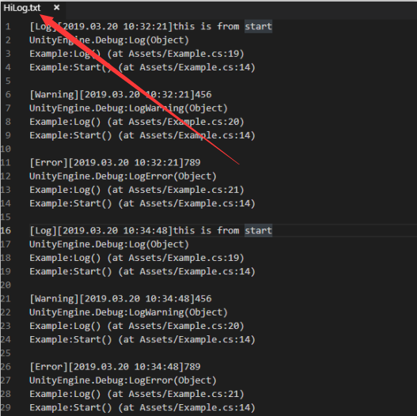

# HiLog_unity
----------------------

[中文说明](https://github.com/hiramtan/HiLog_unity/blob/master/README_zh.md)

### How to use
HiLog have nothing intrusion with your project, and only add one line code then all functionality execute.
```csharp
HiLog.SetOn(true);
```
All functions is centralized in one dll file, just download and copy into your project.

dll download link [](https://github.com/hiramtan/HiLog_unity/releases)

### Functionality
>- Support all platforms(unity editor, exe, Android, iOS, WP...)
>- Add timestamp with user's log(despite new version of unity have this function but it can only in editor platform)
>- Write logs into text file.（path is: application.persistentdatapath）
>- Display logs on screen(can quickly check logs and event have not connect Android studio,xcode)
>- Display stacks and write stacks into text.
>- Only one file and have no relevance with your project

### Screenshot






-------------------

### Details

If you use unity5.x and old version you can download from here[https://github.com/hiramtan/HiLog_unity/tree/Branch_2.4.1](https://github.com/hiramtan/HiLog_unity/tree/Branch_2.4.1)

Will write logs and stacks into text and path is Application.persistentDataPath.

Display logs on screen, will draw a button and you can drag this button to any position on your screen(don't cover your game)
When click this button then popup a panel to display logs and stacks

>- Click every log will show it's stacks.
>- Toggle log or warnning or error can only display this type of logs.
>- Clear all logs on screed.
>- Close logs panel
>- Set font size on screen.

Example：
```csharp
public class Example : MonoBehaviour
{
    // Use this for initialization
    void Start()
    {
        HiLog.SetOn(true);
        Log();
    }

    void Log()
    {
        Debug.Log("this is from start");
        Debug.LogWarning(456);
        Debug.LogError(789);
    }
}
```


support: hiramtan@live.com

***********

MIT License

Copyright (c) [2017] [Hiram]

Permission is hereby granted, free of charge, to any person obtaining a copy
of this software and associated documentation files (the "Software"), to deal
in the Software without restriction, including without limitation the rights
to use, copy, modify, merge, publish, distribute, sublicense, and/or sell
copies of the Software, and to permit persons to whom the Software is
furnished to do so, subject to the following conditions:

The above copyright notice and this permission notice shall be included in all
copies or substantial portions of the Software.

THE SOFTWARE IS PROVIDED "AS IS", WITHOUT WARRANTY OF ANY KIND, EXPRESS OR
IMPLIED, INCLUDING BUT NOT LIMITED TO THE WARRANTIES OF MERCHANTABILITY,
FITNESS FOR A PARTICULAR PURPOSE AND NONINFRINGEMENT. IN NO EVENT SHALL THE
AUTHORS OR COPYRIGHT HOLDERS BE LIABLE FOR ANY CLAIM, DAMAGES OR OTHER
LIABILITY, WHETHER IN AN ACTION OF CONTRACT, TORT OR OTHERWISE, ARISING FROM,
OUT OF OR IN CONNECTION WITH THE SOFTWARE OR THE USE OR OTHER DEALINGS IN THE
SOFTWARE.


### 如何使用
1. 

